# Module 4 Practice: Linux Log Troubleshooting

## Objectives

This module focuses on developing practical skills in analyzing and troubleshooting Linux systems using log files.

## Hands-on

### 1. Linux Logging Fundamentals
Determine which logging mechanism is active before troubleshooting.

#### Systemd journal
```zsh
ps -p 1 -o comm=
```
Checks whether `systemd` is the init system (PID 1).
**Expected Result**: 
- Output show `systemd`
**Note**: 
- If PID is `systemd`, logs are managed by `journald`
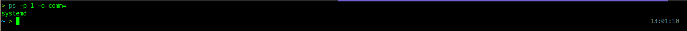

#### Syslog daemon
```zsh
systemctl status rsyslog 2>/dev/null || systemctl status syslog
```
Checks whether a syslog daemon writes logs to text files.
**Expected Result**:
- Service status is `active(running)`
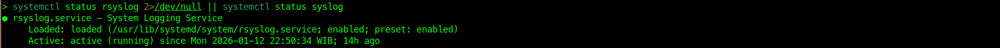


### 2. Log Levels and Severity
Prioritize critical system failures by filtering logs based on their severity level

#### Journal priority filtering
```zsh
journalctl -p err -n 10
```
Display the last 10 log entries with error severity
**Expected Result**:
- only error-level logs are shown
**Note**:
- `err` can be replaced with `warning`, `crit`, or `alert`
- `-n 10` control the number of displayed lines
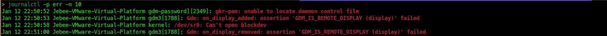

#### Text log keyword filtering
```zsh
grep -i "error" /var/log/syslog 2>/dev/null
```
Searches for error-related keywords in text-based logs.
**Expected Result**:
- lines containing `error` or `err`
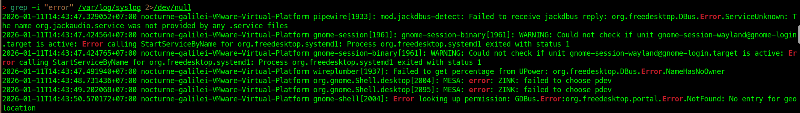


### 3. Indentifying Log Locations and Log Types
Locate system and authentication logs

#### Journal-centric systems
```zsh
journalctl --disk-usage
```
Show how much disk space is used by the journal.
**Expected Result**:
- Journal disk usage information
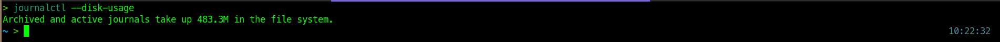

#### File-based systems
```zsh
ls -l /var/log/
ls -l /var/log/[syslog/auth.log/kern.log] 2>/dev/null
```
List common system and authetication log files
**Expected Result**:
- Log files exist and contain timestamps
**Notes**:
- File names differ across distributions
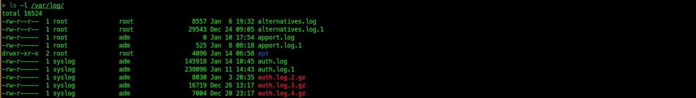
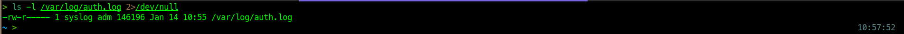


### 4. Viewing and Filtering Logs Using Journalctl
Inspect logs efficiency on systemd-based systems

#### Priority-based filtering
```zsh
journalctl -p info
```
Filters logs by priority level info and above
**Expected Result**:
- Logs from all services with priority ≥ info
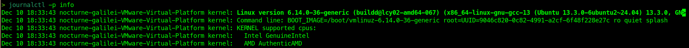

#### Service-based filtering
```zsh
journalctl -u [service] --no-pager
```
Display logs generated by the service
**Expected Result**:
- Only selected service-related log entries
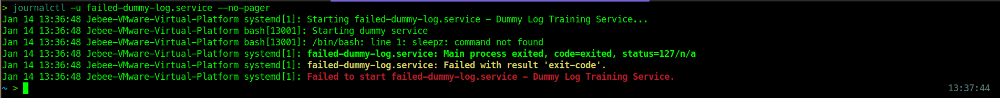

#### Time-based filtering
```zsh
journalctl --since "[time_range]"
```
Limits log output to a specific time range
**Expected Result**:
- Logs from selected time only
**Note**:
- Time range can be adjusted as needed


### 5. Analyzing Authentication and Failed Login Logs
Detect SSH authentication failures

#### Journal-based authentication logs
```zsh
journalctl -u ssh --no-pager | tail
```
Show recent SSH authentication attemps.
**Expected Result**:
- Login attemps with usernames and IPs

#### Text-based authentication logs
```zsh
grep "Failed password" /var/log/auth.log 2>/dev/null
grep "authentication failure" /var/log/auth.log 2>/dev/null
```
Searches authentication failure messages in log files
**Expected Result**:
- Failed login entries listed
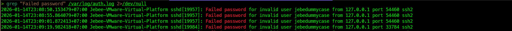


### 6. Analyzing Service Error Logs
Identity service-level errors

#### Systemctl status
```zsh
systemctl status [service]
```
Display service state and recent log excerpts
**Expected Result**:
- Error messages related to service failure
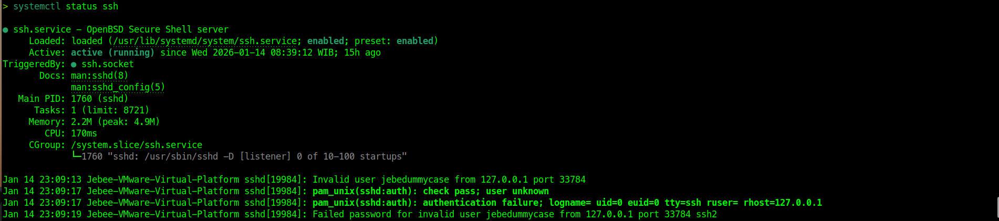

#### Journal error filtering
```zsh
journalctl -u [service] -p err
```
Filters only error-level logs for the service
**Expected Result**:
- Detailed error entries
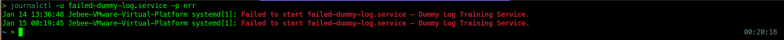


### 7. Troubleshooting Service Startup Failures
Diagnose why a service fails to start

#### Service start attempt
```zsh
systemctl start [service]
```
Attempts to start the service

#### Startup log analysis
```zsh
journalctl -u [service] --since "[time_range]"
```
Reviews logs generated during startup
**Expected Result**:
- Startup or dependency errors visible
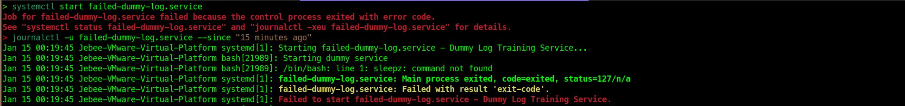


### 8. Identifying Permission-Related Issues from Logs
Detect file access problems

#### Journal search
```zsh
journalctl | grep -i permission
```
Searches permission-related messages in the journal
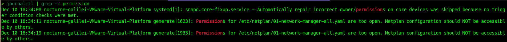

#### Filesystem verification
```zsh
ls -ld [directory]
```
Verifies ownership and permission of directories
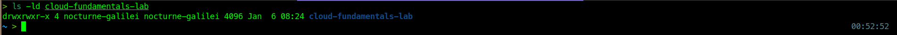


### 9. Detecting Disk and Resource Issues via Logs
Identify resource-related failures

#### Kernel messages
```zsh
dmesg | grep -i error
```
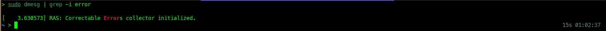

#### OOM detection
```zsh
journalctl -k | grep -i oom
```
**Expected Result**:
- Disk or memory-related errors
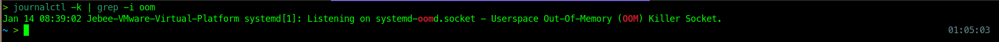


### 10. Monitoring Logs in Real Time
Observe logs while reproducing issues

#### Journal follow mode
```zsh
journalctl -u [service] -f
```
#### Text log follow
```zsh
tail -f /var/log/syslog
```
**Expected Result**:
- New log entries appear continuosly
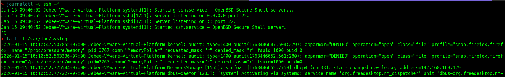


### 11. Documenting Troubleshooting Findings
Preserve log evidence as part of incident documentation for later analysis, reporting, or escalation

#### Step 1. Define Time Window
Determine when the incident occured to avoid exporting unnecesary logs
```zsh
journalctl --since "[time_range]" --no-pager
```
**Why**: Limits log output to the relevant incident timeframe

#### Step 2. Export System Logs
Save logs to a file for documentation or attachment to incident reports
```zsh
journalctl --since "[time_range]" --no-pager > [file_name].log
```
**Expected Result**:
- `file_name.log` contains timestamped system events

#### Step 3. Export Service-Specific Logs
```zsh
journalctl -u [service] --since "[time_range]" --no-pager > [file_name].log
```
**Expected Result**:
- File contains timestamped service events relevant to the selected unit

#### Step 4. Verify Evidence Files
```zsh
ls -lh incident-*.log
head [file_name].log
```
**Why**: Ensure logs were captured correctly and are readable
**Notes**:
- Time ranget `--since` should match the incident timeline
- For better searchabillity and clarity, name all exported log files using format `incident-[service].log`
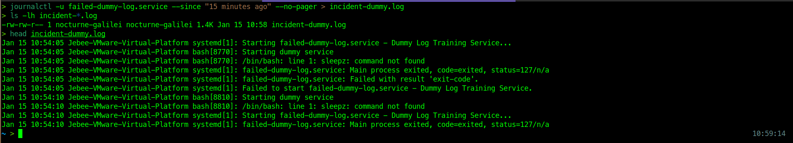
#### Outcome
Log evidence successfully preserved for incident reporting and root cause analysis


### 12. Understanding Log Rotation and Cleanup
Prevent disk space exhaustion caused by continuosly growing log files

#### Step 1. Review Global Log Rotation Configuration
```zsh
cat /etc/logrotate.conf
```
Display the default log rotation policy such as rotation frequiency, retention count,
compression, and permissions

#### Step 2. Review Service-specific Rotation Rules
Lists per-service log rotation cinfigurations that override or extend global rules
```zsh
ls /etc/logrotate.d/
```
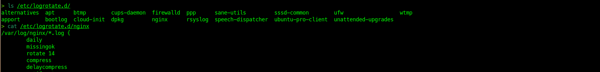
#### Step 3. Verify Log Rotation Output
Show current and rotated log files, including compressed and numbered archieves
```zsh
ls -l /var/log/syslog*
```
#### Expected Result
Rotated log files are present with proper naming and timestamps, indicating log rotation is functioning
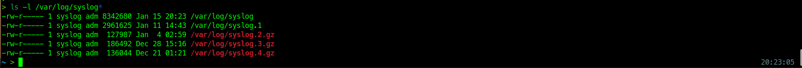

