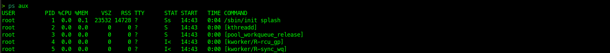
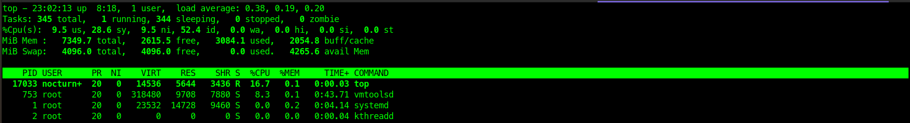
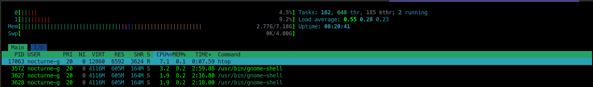
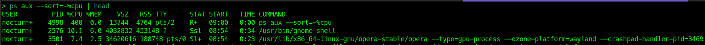
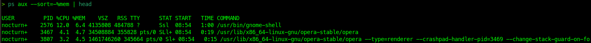

# Module 3 Practice: Linux Process Management


## Objectives

This practice focuses on observing, monitoring, and controlling Linux
processes using common process management commands.

---

## 1. List Running Processes

### View all running processes
```zsh
ps aux
```
### Filter processes by name
```zsh
ps aux | grep [process_name]
```
### View processes in a hierarchical tree
```zsh
ps -ef --forest
```

**Expected Result**:
- Running processes are displayed with PID, user, CPU usage, memory usage, and procces status

**Screenshot**



## 2. Monitor CPU and Memory Usage

### Monitor system perfomance in real-time
```zsh
top
```
### Enhanced interactive monitoring
```zsh
htop
```

**Expected Result**:
- CPU and memory usage are updated in real-time
- Per-process resource consumption is visible

**Screenshot**:
- top

- htop



## 3. Identify High Resource Processes

### Sort processes by CPU usage
```zsh
ps aux --sort=-%cpu | head
```
### Sort processes by memory usage
```zsh
ps aux --sort=-%mem | head
```
**Expected Result**:
- Processes consuming the highest CPU or memory are clearly identified.
**Screenshot**
- Sort by CPU

- Sort by memory



## 4. Stop Running Processes

### Stop running processes (graceful termination)
```zsh
kill [PID]
```
### Force kill processes
```zsh
kill -9 [PID]
```
### Verifiy process status
```zsh
ps -p [PID]
```

**Expected Result**:
- Graceful termination: process terminates gracefully, PID no longer active
- Force kill: Process is immediately terminated, PID no longer in the process list
**Screenshot**:


## 5. Verify Process Termination
### Confirm process no longer exist
```zsh
ps aux | grep [process_name]
```
### Check for zombie processes
```zsh
ps aux | grep Z
```
**Expected Result**:
- Terminated processes are no longer running
- No zombie remain related to the terminated PID

