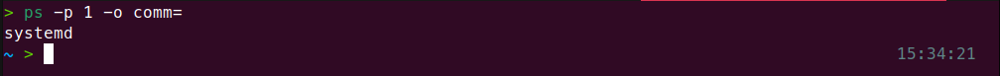
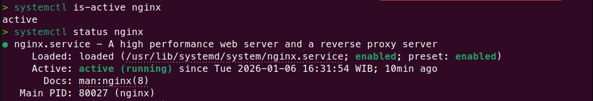
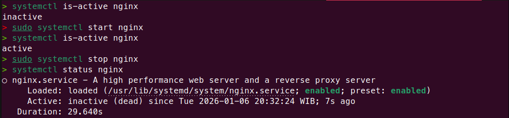
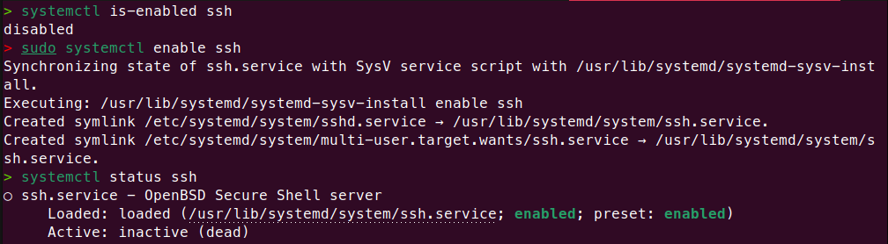
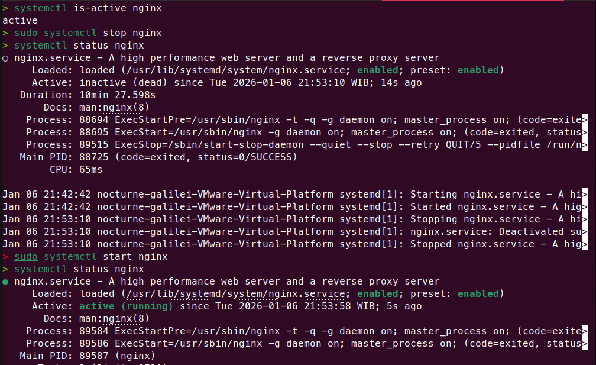
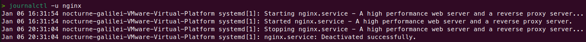

# Practice - Linux Service Management

 
## Prerequisites & Environtment

- **Virtual Machines**: VMware Workstation Pro ver.25H2
- **OS**: Linux Ubuntu ver.24.04
- **Shell**: Zsh
- Linux system using systemd
- User with sudo privileges
- Internet access

## Practice Objectives

Practice hands-on service management tasks using systemctl
and journalctl in a Linux environment.

## Hands-on Steps

### Step 1 - Verify Systemd
**Goal**: Ensure the system is using systemd.
**Command**:
```zsh
ps -p 1 -o comm=
```
**Expected Result**:
```text
systemd
```


### Step 2 - List System Service
**Goal**: Show list active and inactive system services.
**Command: List all active unit service**
```zsh
systemctl list-units --type=service
```
**Command: List all active and non-active unit service**
```zsh
systemctl list-units --type=service --all
```
**Command: List unit file service**
```zsh
systemctl list-unit-files --type=service
```
**Command: List with filter**
```zsh
systemctl list-units --type=service | grep [service]
```
**Expected Output**
- Active/running services are displayed
- --all: view all services including inactive service
- Service unit files and their enable state are shown

**Note**
- **Load**: Load indicates whether a service configuration file exists 
and is loaded correctly(`loaded`), missing (`not found`), or contains errors (`error`)
- **Active**: Active: Active indicates the current service state, 
whether the service is running (`active`), not running (`inactive`), 
failed (`failed`), or locked (`masked`).
- **State**: State indicates whether a service starts automatically at boot (`enabled`), 
requires manual start (`disabled`), is completely locked (`masked`), or starts only when 
required by another service (`static`).


### Step 3. Check Service Status
**Goal**: View the current state and detail of a specific service.
**Command**:
```zsh
systemctl status [service]
systemctl is-active [service]
systemctl is-enabled [service]
```
**Expected Output**:


### Step 4. Manage Service State
**Goal**: Control service lifecycle start, stop, restart.
**Command**:
```zsh
sudo systemctl start [service]
sudo systemctl stop [service]
sudo systemctl restart [service]
```
**Expected Result**: The service transitions correctly between states


### Step 5. Manage Service at Boot
**Goal**: Control whether a service starts automatically at boot.
**Command**:
```zsh
sudo systemctl enable [service]
sudo systemctl disable [service]
```
**Expected Result**: Service is enabled or disabled at boot as expected


### Step 6. Install and Verify Nginx
**Goal**: Install a new service and verify systemd integration
**Command**:
```zsh
sudo apt update
sudo apt install nginx 
```
**Expected Output**:
```text
Active: active (running)
```


### Step 7. Manage Nginx Service State
**Goal**: Control lifecycle of the Nginx service.
**Command**:
```zsh
sudo systemctl start nginx
sudo systemctl stop nginx
sudo systemctl restart nginx
```
**Expected Result**
- Service start and stop successfully
- No error messages are shown


### Step 8. Inspect Nginx Systemd Unit File
**Goal**: Understand how systemd defines the Nginx service
**Command**:
```zsh
systemctl cat nginx
```
**Expected Result**:
- Unit file content is displayed
- ExecStart and service configuration are visible

### Step 9. Analyze Nginx Service Logs
**Goal**: Inspect logs to verify service behavior
**Command**:
```zsh
journalctl -u nginx
```
**Expected Result**:
- Logs related to Nginx service are displayed
- No critical error appear


